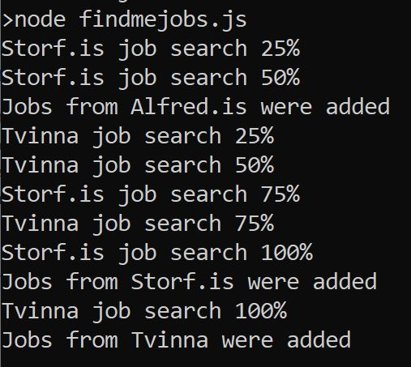

### findmejobs
Ert þú þreytt/ur á að leita í tugi starfsumsókna eftir rétta starfinu?
<br> Væri ekki betra ef þú fengir lista af störfum sem innihalda ákveðinn leitarorð?
<br> Þetta forrit leitar af störfum á Alfred.is, tvinna.is og storf.is fyrir þig og gefur þér lista af öllum þeim störfum sem passa við þín leitarorð.
<br>  
Til þess að nota þetta kerfi þarft þú að vera með Node.js á tölvunni. Hægt er downloada því hérna: https://nodejs.org/en/.

### Notkun: 
1. Hlaða niður zip eða clona repoið.
2. Opna möppuna í command line. (Til dæmis: "cd C:\Users\nafn\findmejobs").
3. Hlaða niður öllum dependency með "npm install".
4. Opna findmejobs.js og bæta við þínum leitarorðum í keywords.
5. Keyra skránna findmejobs.js með "node findmejobs.js" frá command line.
6. Skoða öll störfin sem birtast í Outcome möppunni.

### Dæmi um útkomu:


```
    {
        "name": "Origo hf.",
        "title": "App forritari í heilbrigðislausnum ",
        "href": "https://alfred.is/starf/app-forritari-i-heilbrigdislausnum",
        "date": "2021-11-02T17:20:26Z",
        "desc": "Hugbúnaðarlausnasvið Origo leitar að öflugum app forritara í spennandi hugbúnaðarverkefni. Við viljum efla okkar gífurlega sterka app teymi sem skapar vörur jafnt fyrir einstaklingsmarkað sem og heilbrigðissviðið.Helstu verkefni og ábyrgð - Þróa og viðhalda smáforritum skrifuðum í Flutter - Halda utan um þróunarumhverfi margra smáforrita  - Vinna í hönnunarkerfi  - Greining, hönnun og þróun  - Útgáfustjórnun  - Stuðningur við viðskiptavini Menntunar- og hæfniskröfur - Háskólamenntun á sviði raun- eða tæknivísinda, eða önnur menntun sem nýtist í starfi - Reynsla af app forritun, annaðhvort í Flutter, Native iOS, Android eða React Native  - Reynsla af CI/CD er kostur  - Reynsla af MDM (Mobile Device Management) er kostur  - Hæfni til að vinna í teymi  - Nákvæmni, fagmennska, frumkvæði og ábyrgð við úrlausn verkefna  - Frumkvæði og færni í mannlegum samskiptum Við bjóðum upp á frábæra starfsaðstöðu og búnað, góðan starfsanda og liðsheild, tækifæri til endurmenntunar og þátttöku í verkefnum sem skipta okkur öll máli. Við hvetjum ykkur til að kíkja við á Facebook síðu OrigoHÉRog LinkedIn síðuna okkarHÉR.Þar má finna skemmtilegar umfjallanir um flottu verkefnin sem við höfum verið að vinna að og einnig kynningar á starfsfólkinu okkar og hvað þau hafa að segja um vinnustaðinn.MyndbandSótt er um starfið hér á vef Origo. Umsóknarfrestur er til og með 17. nóvember 2021. Allar umsóknir og fyrirspurnir verða meðhöndlaðar sem trúnaðarmál og þeim svarað. Nánari upplýsingar veita sérfræðingar á mannauðssviði Origo, (mannaudur@origo.is)"
    },
    {
        "name": "Ankeri Solutions",
        "title": "Full Stack / Back-End Developers",
        "href": "https://alfred.is/starf/full-stack-back-end-developers",
        "date": "2021-10-31T21:01:06Z",
        "desc": "Ankeri is looking for new team members to help continue building a great software company within the international maritime industry. Our customers are some of the largest shipping companies in the world and our mission is to find ways to increase their productivity and performance through smart use of data.We are looking for computer scientists or software engineers with a passion for building pragmatic cloud-based products with a high impact for their users. New team members will play key roles in improving existing products and building new ones in a fast-paced environment with short release cycles using the Shape Up methodology.We are looking to fill various software developer roles, with a focus on the following characteristics, experience and interests: - Result driven with analytical mindset - Passion for clean code as well as an interest in the business logic behind it - Python and web frameworks - Relational DBs as well as NoSQL databases - Designing and building APIs - HTML, JavaScript, and CSS (basic knowledge required, back-end developers are also encouraged to apply) - All the standard things such as version control, unit testing, etc.We are a small team where each member is valued and has a voice. We strive to keep our technology stack fresh and up-to-date, and have an ambition to keep our software development processes lean and effective by re-evaluating them as a team on a regular basis. We are flexible, concerned about our team members’ well-being and value variety.If you are a highly motivated, autonomous, and service oriented person that also enjoys working in teams, we would love to get to know you better.For more information feel free to contact Ankeri's CTO, Leifur A. Kristjánsson (leifur@ankeri.is)."
    },
```

### Gallar
Ekki er hægt að leita af Javascript, HTML og CSS eins og er hjá Tvinna.is og Storf.is þar sem leitað er í HTML kóða hjá þeim.
<br> En það er hægt hjá Alfred.is.
<br>
<br> Ef leitarorð er t.d. react að þá mun það passa líka við reaction. Þetta verður lagað í framtíðinni.

### Alfred.is
Ætti einungis að taka nokkrar sec að fá niðurstöður.

### Tvinna.is & Storf.is
Ætti að taka 3mín að fá niðurstöður.
